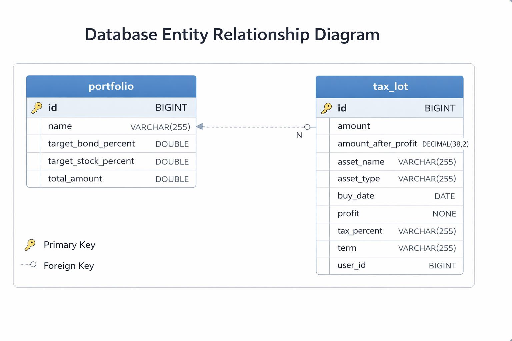

# Tax-Aware Portfolio Rebalancing Engine

A **Tax-Aware Portfolio Rebalancing Engine** built using **Java Spring Boot** that generates an optimized execution plan to reach a target portfolio allocation while **minimizing total realized tax**.

---
## 🧰 Technology Stack
| Component | Technology |
|---|---|
| **Backend** | Java 17, Spring Boot , Maven |
| **Database** | MySQL |


---
## 📧 Contact
For issues or support, please contact the project maintainer:

**Priyanka Verma**  
📩 vrmapk1551@gmail.com


---
## 📁 Project Structure
```
The project is organized into one folder only: backend.

├── backend/
│   ├── src/main/java/
│   │   └── com.com.tax_aware_rebalancer/
│   │       ├── translator/   # Maps STO to entity
│   │       ├── config/       # Configuration classes
│   │       ├── controller/   # API endpoints
│   │       ├── service/      # Business logic
│   │       ├── dto/          # Data Transfer Objects
│   │       ├── repository/   # JPA repositories
│   │       ├── entity/       # Database entities
│   │       └── exception/    # Custom exceptions
│   ├── src/main/resources/
│   │   ├── sql/
│   │   │   └── sql-query.txt  # Database schema
│   │   ├── data.sql           # SQL scripts
│   │   └── application.properties  # App configuration
│   └── pom.xml
└── README.md
```

---
## 🚀 Quick Start Guide
### ✅ Prerequisites
- Java 17
- Maven
- MySQL
- Git
- IntelliJ IDEA or STS

### 1. Clone the Repository
```bash
git clone https://github.com/priyanka803/kane-assignment.git
cd tax-aware-portfolio-rebalancing
```

### 2. Create the Database
```sql
CREATE DATABASE rebalance_db;
```

### 3. Build & Run the Backend
```bash
cd backend
mvn clean package
java -jar target/tax-aware-portfolio-rebalancing-0.0.1-SNAPSHOT.jar
# OR
mvn spring-boot:run
```

---
## 🗺️ API Endpoints
| HTTP Method | Endpoint | Description | Request Body Example |
|---|---|---|---|
| **POST** | `/api/taxLot/save` | Buy a new Tax Lot | `{ "assetName": "Apple Inc", "amount": 1000.50, "buyDate": "2025-01-10", "term": "LONG", "assetType": "STOCK", "taxPercent": 15.5, "userId": 1 }` |
| **GET** | `/api/taxLot/get/{userId}` | Get tax lots for a user | None |
| **GET** | `/api/taxLot/getAll` | Get all tax lots | None |
| **DELETE** | `/api/taxLot/delete/{id}` | Delete a tax lot | None |
| **PUT** | `/api/taxLot/update` | Update tax lot profit | `{ "assetId": 5, "profit": -120.75 }` |
| **POST** | `/api/portfolio/save` | Create a new portfolio | `{ "name": "Retirement Fund", "totalAmount": 50000.00, "targetStockPercent": 60.0, "targetBondPercent": 40.0 }` |
| **GET** | `/api/portfolio/get/{userId}` | Get portfolio by user | None |
| **GET** | `/api/portfolio/rebalance/{userId}` | Rebalance portfolio | None |

---
## 🧾 Swagger / OpenAPI Documentation
### 🌐 Swagger UI
```
http://localhost:8080/swagger-ui/index.html
```

### 📍 Jump to Update API Docs
```
http://localhost:8080/swagger-ui/index.html#/tax-lot-controller/update
```


## 🚀Application End-to-End Workflow

1. **Create User Profile**
   - User registers and profile is created in the system.
   - System stores user details in the database and generates a unique `userId`.
 - API Call:
     ```
     POST /api/portfolio/save
     ```

2. **View Portfolio**
   - User can view their portfolio after profile creation.
   - API Call:
     ```
     GET /api/portfolio/get/{userId}
     ```

3. **Save Tax Lot (Buy Asset)**
   - User purchases an asset and saves it as a tax lot linked to their `userId`.
   - API Call:
     ```
     POST /api/taxLot/save
     ```
   
4. **Update Tax Lot (Profit/Loss)**
   - User updates profit or loss on a specific tax lot , for profit enter positive number and for loss enter negative number.
   - API Call:
     ```
     PUT /api/taxLot/update
     ```
  
5. **Rebalance Portfolio**
   - User triggers portfolio rebalance to align current allocation with target stock/bond percentages.
   - API Call:
     ```
     GET /api/portfolio/rebalance/{userId}
     ```
---
---
## ⚙️ Configuration
### `backend/src/main/resources/application.properties`
```properties
spring.application.name=tax-aware-portfolio-rebalancing
server.port=8080
spring.jpa.database-platform=org.hibernate.dialect.MySQLDialect
spring.jpa.hibernate.ddl-auto=update
spring.jpa.show-sql=true
spring.jpa.properties.hibernate.format_sql=true
spring.datasource.url=jdbc:mysql://localhost:3306/rebalance_db
spring.datasource.driverClassName=com.mysql.cj.jdbc.Driver
spring.datasource.username=root
spring.datasource.password=root
```
### Database Design
 

---
## ⚠️ Deployment & Troubleshooting
For first run:
```properties
spring.jpa.hibernate.ddl-auto=create
```
Then switch back:
```properties
spring.jpa.hibernate.ddl-auto=update
```


